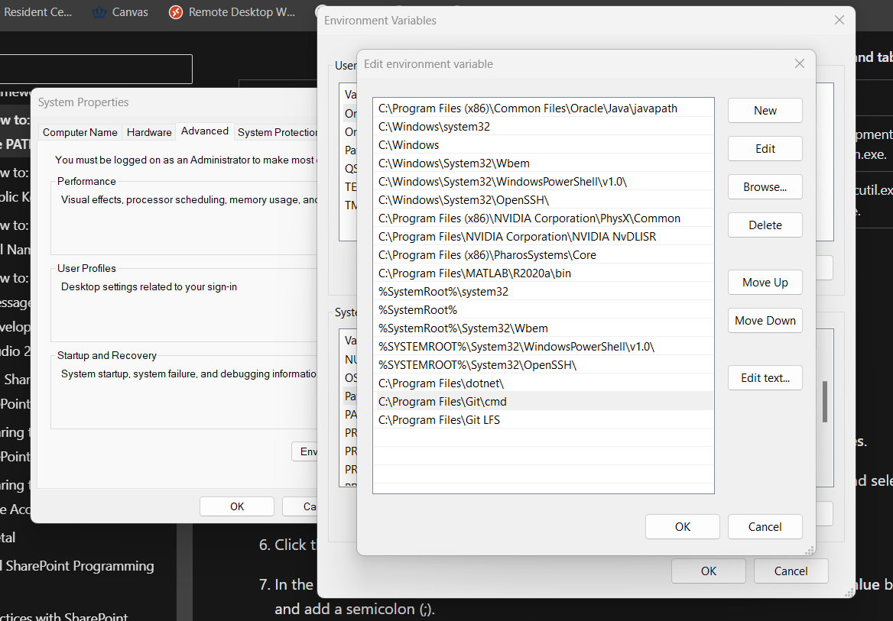

# Game395

Devin Young

## Unity Week 1 Assignment

- Git
- GitHub Desktop
- GitLFS
- Unity
- VSCode

### Git Path Variable

## Week 2

**What is Git?**  
Git is a free version control software

**What is GitHub?**  
GitHub is a visual interface fro the Git software

**What would you have in a .gitignore file to make sure to NOT track a specific file type?**  
To not track a specific file type you would put a wildcard flag in front of the file type in the .gitignore file which would tell Git not to track those specific files

*.txt in the .gitignore file would tell Git to ignore all .txt files